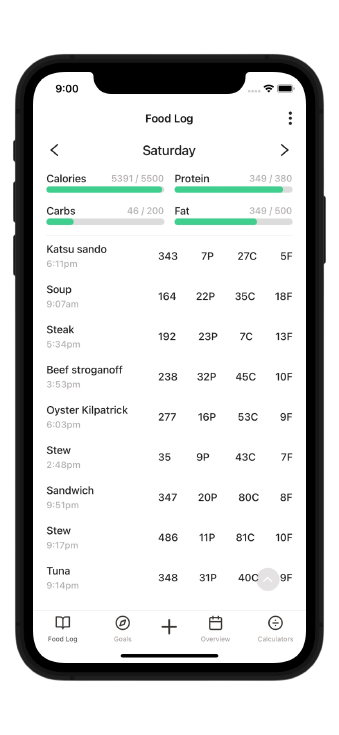

# Nutrition Tracking App

<!-- 

 -->

A dead simple daily macros tracker. Built because all the other apps were overkill for someone who doesn't want to create an account, track graphs and generally has a good idea what the nutritional profile of their food is.

 

<!-- 
 -->
<!--   -->
  
<!-- 
 -->

## Features

- Set daily macronutrient goals.
- Track daily progress.
- Log and save foods.
- Convert between kj and calories.
- TDEE calculator.

## Stack

- React Native + Expo
- Typescript
- Zustand for state management
- reanimated
- react-navigation
- @gorhom/bottom-sheet for bottom sheets
